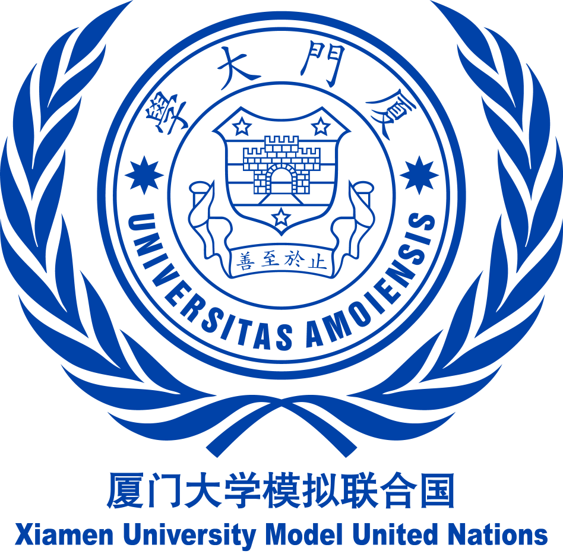
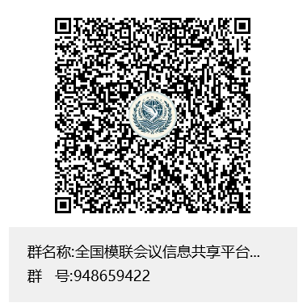
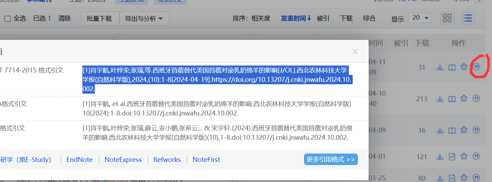

# 如何速通模拟联合国常规委员会

    

**编写时间：2024/4**

**作者：厦门大学 叶思苇**

## 目录

[[toc]]

## 许可协议

**本文适用于署名-非商业性使用-禁止演绎4.0通用版权协议 （CC BY-NC-ND 4.0 DEED）**

**您可以自由地：**

1.  **共享**--- 在任何媒介以任何形式复制、发行本作品。

2.  只要你遵守许可协议条款，许可人就无法收回你的这些权利。

**惟须遵守下列条件：**

1.  **署名**
    > 您必须署名"叶思苇"，提供指向本许可协议的链接，同时[标明是否（对原始作品）作了修改](https://creativecommons.org/licenses/by-nc-nd/4.0/deed.zh-hans#ref-indicate-changes)。您可以用任何合理的方式来署名，但是不得以任何方式暗示许可人为您或您的使用背书。

2.  **非商业性使用**
    > 您不得将本作品用于[商业目的](https://creativecommons.org/licenses/by-nc-nd/4.0/deed.zh-hans#ref-commercial-purposes)。

3.  **禁止演绎**
    > 如果您[再混合、转换、或者基于该作品创作](https://creativecommons.org/licenses/by-nc-nd/4.0/deed.zh-hans#ref-some-kinds-of-mods)，您不可以分发修改作品。

4.  **没有附加限制**
    > 您不得适用法律术语或者[技术措施](https://creativecommons.org/licenses/by-nc-nd/4.0/deed.zh-hans#ref-technological-measures)从而限制其他人做许可协议允许的事情。

**声明：**

您不必因为公共领域的作品要素而遵守许可协议，或者您的使用被可适用的[例外或限制](https://creativecommons.org/licenses/by-nc-nd/4.0/deed.zh-hans#ref-exception-or-limitation)所允许。

不提供担保。许可协议可能不会给与您意图使用的所必须的所有许可。例如，其他权利比如[形象权、隐私权或人格权](https://creativecommons.org/licenses/by-nc-nd/4.0/deed.zh-hans#ref-publicity-privacy-or-moral-rights)可能限制您如何使用作品。

## 前言

从外交学院于1995年6月首次在中国大陆独立举办模拟联合国活动算起，中国的模拟联合国活动已经延续了将近三十年。在这个过程中，模拟联合国的参与群体不断向下延伸，从高校走向中学，再到如今甚至出现了"小学场"。今天，参加一场模拟联合国会议的准入门槛已经很低很低，只要你有一颗想参会的心，有合适的时间和足够的精力，你随时都可以开始准备参会。

随着模拟联合国活动从"精英化"向"大众化"的转变，再加上三年的疫情等诸多因素，使得会议质量普遍下降、模联社团大量断层，这让许多模联新人无所适从。在这个后疫情时代，笔者希望能在"大趋势"下尽一点微薄之力，通过本人的一些经验之谈与所见所闻，让后辈能少走一些弯路，让中国模联的"代表基本盘"更加稳固。

    

如果你缺少有关模拟联合国会议的信息渠道，不知道哪里有模拟联合国会议，抑或是想要扩展眼界，了解更多的模联知识，与来自全国各地的模联同仁讨论会议机制与时事热点，欢迎加入由笔者建立的"全国模联会议信息平台"，QQ群号948659422。本群将每日更新全国各地的模联会议信息，尽可能在第一时间推送相关讯息。

叶思苇

2024届厦门大学模拟联合国协会秘书长

## 会前学术准备

### 对会议与委员会的选择

如果你突然心血来潮，想要参加一场模拟联合国大会，那你应该会经常遇到一个问题，就是"我要选哪个会议参加呢？"

有以下几个因素是你在选择会议时应该考虑的：

1. **这个会能不能办？** 在2024年的当下，所有的模拟联合国会议都面临着一个最基本的问题，即代表从哪里来？而你作为一个想要参加会议的代表，也应当考虑这个会议有没有稳定的代表盘（背后有哪几所学校的模联社团支持，往届的代表规模多大，在同一地区和同一时段的竞争情况怎么样），它的会费、背书、学术团队和学术设计是否对其他人也具有吸引力，它有没有被院校取缔的风险。如果你选择了一个办不了的会，那自然也没法参会了。

2. **钱**。去参会本身也是一种消费行为，你需要考虑自己手上的资金是否能支撑去参一场会，你的父母愿不愿意让你去参会。**去外地参会所需的金额=路费+会费+住宿+餐饮**，如果选择本地参会或者线上会的话主要的支出也就是会费了。因此，如果你是一个新手，而你当地恰好又有适合的会议，可以优先考虑本地会议作为你的起点。

    另外，目前院校会的会费价格基本在600元以下，如果你选择了一个会费价格在1400元以上的会议，那么这个会议可以基本判定为商业会，它的会费有很大一部分都进入股东的荷包、机构的获客以及营销成本，本身的性价比并不高。

3. **时间**。你需要先看看自己和这个会的会期是否有日程冲突，比如你同期有没有别的会、有没有考试、在那个时间点是否有精力参会等等。

4. **会议的学术水平**。在会议通告中，一般都会公示委员会的介绍和学术团队的履历，尤其是通过后者，可以大致了解会议的学术水平处于什么档次。

5. **会议的整体代表水平**。其他代表的水平很大程度上也会影响你的参会体验，同时，你也需要考虑这个会议的代表来源主要是中学生还是大学生。作为新手，去参加新手会算是比较推荐的，因为新手会是一个一边开会一边教学的过程；倘若你直接去参加全国级别的大会，这对你个人的精力会损耗比较大，到会场时你也可能会无所适从，因为你可能还不知道你该干什么，就得稀里糊涂上场了。

    以上五点是你选择会议时可以考虑的要素。在选择完会议后，你就面临着对委员会的选择。对委员会的选择先看语言，再看类型。委员会的语言主要分为中文委和英文委，一些院校会还有法文和西班牙文等小语种。如果你对自己的英文水平有自信，那试试英文委也未尝不可。倘若你的英语水平无法做到基本的听说读写，那最好还是选择中文委作为你的第一场会。（英文委本身不提升英语水平）

    在委员会类型上，新手还是比较推荐选择常规委员会。因为：

   1. 它**成熟**。当前的常规委员会所用的议事规则大部分是基于罗伯特议事规则所衍生出的美式议事规则，在国内外的模联会议上都较为一致，适合新手初步了解模拟联合国活动的基本机制。

   2. 它的**难度适中**，机制公平。常规委员会的代表基本都是扮演某个国家在某个联合国系统下的委员会的外交官，大家至少代表权限上都是一致的，都是一国一票。常规委员会的大体流程是基本稳定的，不会像危机联动一样需要代表对危机随机应变，这也使得代表需要应对的机制和信息不会过于复杂。

### 国家席位与学术测试

在一般的常规委员会中，国家席位的分配通常都是依据代表学术测试的成绩，同时参考代表选择的席位志愿。一个好的席位，一个适合你的席位，能够让你在会场上有更好的参会体验。

先说国家席位的选择。主席团一般会在发布学术测试的同时配上该委员会的国家席位设置表。你可以先按照这些国家在这一议题上的立场，以及这些国家在现实中存在的国家集团（Bloc），如北约、东盟、集体安全组织等，利用excel进行对各种立场和各个国家集团的成员数量的统计。

以下是对一个巴以议题的常规委员会的国家席位分类，我将以这份分类来对席位选择进行分析，可以作为一个参考示例。

    

::: tip
由于在该会议节点时英国还未脱欧，因此将其划分至欧盟
:::

这一委员会的国家席位总数为30，三分之二多数为21，简单多数为16。从表上可以明显看出，偏向巴勒斯坦的国家的数量比偏向以色列的国家要多，且中立国家也多基本是发展中国家。因此，选择中国、巴勒斯坦、俄罗斯、伊朗等席位，在这一议题上可以获得票数上的优势。

但与此同时，也应该注意到西方阵营占据了11席，这个票数可以使得巴勒斯坦方面的决议草案被否决。那么，选择法国、德国等欧盟国家的席位，作为一个独立的第三方的Bloc
Leader在巴以之间进行调和，也是一个可以考虑的选择。

对于学术测试，有以下几个要点和原则需要注意

1.  参考来源。一定不要拿自媒体、营销号、百度百科等渠道作为你的"参考文献"，在不少学术团队眼中这属于减分项。知网、联合国、世界银行以及各国的政府官网是比较推荐的资料获取来源。在现实中委员会在该议题的已有决议也可以给你带来启发。同时，如Jstor，Taylor&Francis之类的外文数据库内的资料也是推荐引用的。在知网、Jstor等数据库中，在论文的页面上一般都有复制引用的按钮，你可以将其复制到你的学术测试的末尾。此外，你也可以通过背景文件中的脚注和尾注，去查找相关的资料、决议与论文。

    

        
    

    ::: tip
    对学术团队而言，能在批阅了一堆引用诸如"百度百科"、"丁香医生"、"观察者网"的学术测试后，看到你这篇引用了大量外文论文的学测，自然会对你有所青睐。
    :::

2.  查重率和AI写作。在AI的使用上，最好不要抱着侥幸心理，学术团队基本上都能有效甄别出进行了AI写作的学测，并通过如GPTZero的软件来进行检测。在论文的引用上，还是需要按照大会的要求来使你的查重率符合规范，尽可能避免出现全篇查重率超过50%以上的情况。文献的引用最好要通过脚注和尾注体现。

3.  学会分点和分段。这和高中文科答题是一样的道理。

4.  结合议题、委员会与时代背景进行答题。这就需要你阅读背景文件，查阅相关论文，搜集相关决议，然后再进行答题，而不是根据个人模糊的感知或刻板印象胡编乱造。

5.  答题要有逻辑性。对于一些特定事件的议题，如伊拉克战争、巴以冲突、纳卡问题等，可以套用5W1H[^1]的框架对事件进行剖析，将事件的来龙去脉能够梳理明白。对于一些综合性的议题，可以按照PEST的框架来分析（政治、经济、社会、技术）。

6.  对于一些规则性的问题或者出自背景文件的问题，要善用"Ctrl+F"的快捷键进行查找。

7.  语言风格要学术化，避免口语化、抒情化。因为你不是作为一个作家，带入个人感情地对某一事件进行宏大叙事，而是需要作为一个外交官，从多方面的角度对事件进行客观的分析。

8.  注意学术测试截止时间。你不需要把手上全部的资料都通读一遍，正如你考试之前也不可能把课本全部过一遍。在对一道题目有了大致的把握后就可以先进行答题，遇到障碍时再查阅相关的资料。尽可能在学术测试截止时间之前提交学测，不要一直拖延。

### 席位分配后应当做的事

从席位分配后到正式开会前的这段时间，很大程度上可以决定你本次会议的"成败"。以下列举的一些事项是你在会前可以进行的。

1. **会前磋商**

    ::: tip
    如果你的委员会实行“会前无线电屏蔽+各国互相断交”的所谓学术政策，请无视此条。
    :::

    还记得我们在前文中提到的"国家席位分类"吗，你可以通过这张表，优先添加和你在同一个国家集团或在该议题上立场相近的国家代表。他们将成为你的Bloc的主要成员。

    另外，立场较为中立的代表也是重要的拉拢对象，你可以尝试询问他们在本次会议的立场和诉求，找到利益共同点，争取让他们和你站在同一阵线。对于你预设的"假想敌"，你也应当与对方建立有效的沟通途径，以便后续的谈判与磋商。

    在会前磋商中，一些原则是需要你遵守的。包括：

   1. 自己要先心里有数，列好框架。首先，你要先确定你自己的立场和在本次会议中的利益诉求以及会议目标，然后在此基础上再去展开磋商。这可以纳入到你的立场文件和议题拆分的写作思路中。

   2. 不要表现得操之过急。当对方还没考虑好立场或对会议的展望时，不用要求对方给出一个明确的答复，给对方留足时间去思考。

   3. 保持礼貌，但不要过度拘谨。在和其他代表交涉时，应该礼貌用语，尊重他人，避免引发不必要的争端。但是，在私下场合，也不应过于正式。例如："我谨代表沐浴在承上帝洪恩的大不列颠及北爱尔兰联合王国，遵循大不列颠及北爱尔兰联合王国及其领土和属地国王、英联邦元首、国教的捍卫者查尔斯三世的意志，向贵方致以诚挚的问候......"这样的表达不适用私下与其他代表的交往，会影响磋商的效率和其他代表与的耐心。

   4. 对不同国家要有针对性，尤其是你希望与之合作或拉拢的国家。在磋商之前，你应当搜集相关资料，思考你的磋商对象在这一议题上的立场与诉求是什么，在此基础上与对方展开磋商会更有效率。

   5. 不要认为口头承诺或会前签署的协议有所谓的"法律效力"，谨防"电信诈骗"。这一条在会前和会中都适用。在一般的常规委员会中，学术团队承认的会议文件一般只有：立场文件、工作文件、指令草案、决议草案。（议题拆分/议程单需要根据学术团队的规定来判定）

#### 建立国家集团(Bloc)

在大部分的议题上，各国通常都会形成各自的国家集团，来表明其趋同的立场与诉求。若主席团没有明确限制，在会前组建国家集团是十分必要的。

对于国家集团的组建，有以下几个要点是需要注意的：

1.  在组建之前，应当与你的其他集团成员讨论并确定集团的领导核心，由谁牵头建立国家集团。

2.  国家集团可以基于现实中已有的政府间国际组织来建立，如欧盟、东盟、七十七国集团[^2]、集体安全条约组织[^3]等。一个国家可以加入多个国家集团。

3.  集团成员应当是你可以信任的对象，是和你立场相近的国家，而不是容易反水或向其他集团的泄漏信息的"间谍"。当然，你也可以建立内外群，通过外群来团结更多的国家，将内群作为你的集团基干。

4.  如果条件允许，建群后最好将主席团拉入群中。主席团一般需要通过代表建立的群聊，来观察和评估代表的会下磋商与谈判情况，使评奖更加客观公正。

    国家集团组建后，集团内部可以先线上开个小会，确定整体的大致立场与会议方向，并着手准备议题拆分的写作，来有效把控会议议程。

### 议题拆分

议题拆分是各国代表在会前拟定的将一个会议议题拆分为多个小点的框架性文件。在某些会议上，它以"议程单"的形式发挥这一功能。在另外一些会议中，"议题拆分"这一文件并不受到主席团的认可，但是可以考虑以工作文件的形式提交。

#### 以下是一篇议题拆分的示例：

议题拆分

委员会：**联合国难民署**

议题：**俄乌冲突所引发的难民问题处置**

起草国：**美利坚合众国、乌克兰**

1. 乌克兰境内的难民安置问题

    1.1 流离失所者的庇护所问题

    1.2 基础设施的恢复问题

    1.3 境内流离失所难民的安全保障问题

2. 乌克兰境外难民权利保障问题

    2.1 难民的社会融入问题

    2.2 难民人权保障问题

    2.3 难民就业优化政策

    2.4难民中的妇女儿童保护问题

3. 乌克兰难民的遣返回国问题

   3.1 乌克兰难民的安全遣返问题

      3.1.1. 难民遣返路线的规划

      3.1.2. 对难民遣返通道的安全保障

4. 对弱势群体遣返途中的人道主义援助

5. 对难民接收国的国际支持与援助

    5.1 难民接收饱和国对外转移难民问题

    5.2 对难民接收国的国际经济援助问题

6. 对其他问题的讨论

#### 议题拆分的存在意义，包含以下几个方面：

1.  **凝聚人心**。议题拆分一般将会是国家阵营组建后的第一个集体的文件成果。在撰写议题拆分的过程中，国家集团的各个成员可以有效磨合，为后续的文件写作与成员分工打好基础。

2.  通过议题拆分，会议的讨论方向能够更有逻辑，代表可以参考议题拆分的顺序，来对其所列的各个子条目分别进行讨论。

3.  **帮助你的国家集团把控议程**。虽然议题拆分的内容较为客观，不太能表现出国家立场与利益冲突，但是，起草国可以决定将哪些议程放在议题拆分上，同时回避那些对己方不利的议程，最终达到影响会议走向的效果。

4.  **作为后续文件写作的框架**。你的国家集团可以基于议题拆分上的各个条目来分工写作，完成工作文件与决议草案。

完成议题拆分的写作后，你可以尝试向其他国家集团"推销"这份文件，来使后续的会议进程更加顺畅，更加符合你的国家立场与利益诉求。

### 立场文件

在常规委员会中，主席团一般会要求代表在会前提交立场文件。立场文件是模拟联合国会议讨论的基础文件，它反映了"各国"针对会议所讨论问题的原则立场，并对如何解决上述问题提出本国的意见与具体建议，它也是一国发言的基调。立场文件要力图真实、完整地反映模拟国家的立场。[^4]

一篇立场文件由以下几个主要部分构成：

1.  **本国在该议题上的立场。** 具体的内容可包括：本国在该议题上的历史介绍和已有行动、本国签署的相关协议、本国对于该议题的政策和立场、支持本国立场与行动的相关数据与事实等。

2.  **本委员会在该议题上的已有行动，以及本国与委员会或其他国际组织在该议题上的合作。** 具体可以搜索该委员会的资料库，以及该委员会的相关决议。

3.  本国对该议题的**建设性意见**和对本次会议的展望，这一点是立场文件中最重要的部分。这一部分需要体现你还有你的国家集团对于本次会议的具体诉求，即"希望最终的决议草案出现哪些条款，希望委员会对这一议题做些什么"。要注意，常规委员会是一个多边平台，而不是两个国家之间的双边谈判；同时，决议的实施主体是委员会，而不是部分国家。建设性意见的格式最好与决议草案中的行动性条款相同，使你的文件写作具有衔接性。

关于资料查找和文献引用，请查阅"国家席位与学术测试"这一章节，这里不再赘述。

总之，在写作立场文件时，需要尽量使文体显得官方和正式，避免口语化。同时，需要注意贴合实际，不要空谈态度和立场，要善用事实与数据来支持你的意见。

## 会前物质准备

在开始正式会议之前，除了学术准备，你还需要进行物质上的准备，来让你的参会之旅更加顺利。

### 交通

当你前往外地参会时，一般会选择高铁或飞机作为你的出行方式。有以下几个事项是你需要注意的：

1.  订票前确认是否存在日程冲突。退票改订的费用也是不小的一笔开支，你需要尽可能避免出现这样的尴尬情况。如果与学校课程存在冲突，记得提前请假。

2.  在会前2\~3周订机票，不要过早或过晚订票。如果你选择飞机出行，最好在会前2\~3周的每天都关注是否有低价实惠且时间合适的航班。过早或过晚订票都会使机票价格偏高。具体可以自行上网搜索相关的订票攻略。

3.  不要过度贪图便宜而选择红眼航班。如果你在三更半夜到达，并且机场处于郊区，那么打车前往酒店的费用可能远远大于你贪图的便宜。另外，乘坐红眼航班容易影响你在会场上的发挥。

4.  记得值机选座。大部分航班都有通过软件线上值机选座的途径，你可以考虑和你的同伴坐在一起，在航班上讨论开会策略。

5.  如果你选择通过铁路参会，并且会期在国庆、五一、清明、春节等节假日时，请通过12306设置开售提醒进行抢票。

    此外，如果你想要去省内的其他城市参会，并且你学校的代表数量较多，可以考虑一起包车往返来降低成本。

### 住宿

一般来说，大会组委都会和酒店签订协议，以较低的价格为代表提供住宿。以下是一些你需要注意的事项：

1.  **选择室友**。一般酒店提供的大部分房间是两人间的套房。为了节约住宿成本，组委会推荐代表两人住一间。如果你有意向室友，应当与室友预先协商好，避免出现"A想和B住，B想和C住"之类的尴尬情况。

2.  **保存房卡**。在参会期间，请务必保管好房卡，避免丢失。另外，如果酒店只提供一张房卡，请和你的室友协商好房卡由谁保存。

3.  当组委没有签订协议，需要你自己选择酒店时，你需要优先考虑该酒店与参会地点的距离，以及该酒店的交通便利程度。

4.  如果你是未成年人，请预先和家长沟通好。当你入住时，酒店可能需要和你的家长联系以获取入住许可。

### 必带物品

在前往会场前，请务必清点好行李，避免有物品忘带。以下一些物品是你需要提前进行准备的：

1.  **身份证**。无论是酒店入住还是乘坐高铁、飞机，都需要查验你的身份证。如果你的身份证已经遗失，请尽快补办。

2.  **智能手机，笔记本电脑/平板电脑**。会场里一般没有WIFI，因此需要携带智能手机为电脑提供热点。笔记本电脑/平板电脑是你文件写作时必备的工具。

3.  **排插、充电宝与充电线**。在会场中的充电插口总是有限的，因此务必需要多带充电宝与充电线。另外，你多带的充电宝/充电也可以用来支持你的Bloc成员。

4.  **服装**。如果你参加一场3\~4天的会议，请携带一套西装，1\~2件衬衫（最好是两件），一条领带和一条皮带。此外，你需要备一套常服（尤其是在南方的夏天参会），一套睡衣。当然，你也可以根据席位，在不违反法律法规的前提下，选择相应的民族服装参加会议。如果你实在资金紧张，选择穿学校制服一般也是允许的。

5.  **鞋子**。在正式会议时，最好穿皮鞋或高跟鞋，而不是运动鞋。当然，会议之外，最好还是备一双运动鞋。如果你实在腿脚不便，穿运动鞋出席会议一般也是允许的。

6.  **袜子**。最好穿深色袜子，与你的西装相适应。

7.  组委要求的参会承诺书等材料。

## 发言

### 主发言

### 有主持核心磋商

### 自由磋商

## 文件写作

## 对议事规则的合理运用

[^1]: 即when, where, who, what, why, how

[^2]: 七十七国集团是一个由134个发展中国家组成的经济组织，旨在促进成员的集体经济利益，并增强其联合谈判能力。

[^3]: 集体安全条约组织是一个区域性国际组织，其成员国目前包括6个国家：亚美尼亚、白俄罗斯、哈萨克斯坦、吉尔吉斯斯坦、俄罗斯和塔吉克斯坦。其既定目标是促进国际和区域层面的和平、安全与稳定，集体保护成员国的独立、领土完整和主权，成员国优先考虑以政治手段解决冲突。

[^4]: https://www.un.org/zh/mun/prepare/lichangwenjian
