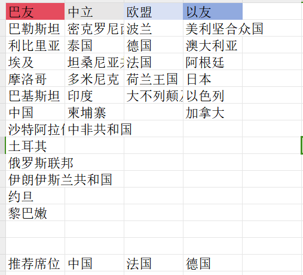

# 如何速通模拟联合国常规委员会

    

**编写时间：2024/4**

**作者：厦门大学 叶思苇**

## 目录

[[toc]]

## 许可协议

**本文适用于署名-非商业性使用-禁止演绎4.0通用版权协议 （CC BY-NC-ND 4.0 DEED）**

**您可以自由地：**

1.  **共享**--- 在任何媒介以任何形式复制、发行本作品。

2.  只要你遵守许可协议条款，许可人就无法收回你的这些权利。

**惟须遵守下列条件：**

1.  **署名**
    > 您必须署名"叶思苇"，提供指向本许可协议的链接，同时[标明是否（对原始作品）作了修改](https://creativecommons.org/licenses/by-nc-nd/4.0/deed.zh-hans#ref-indicate-changes)。您可以用任何合理的方式来署名，但是不得以任何方式暗示许可人为您或您的使用背书。

2.  **非商业性使用**
    > 您不得将本作品用于[商业目的](https://creativecommons.org/licenses/by-nc-nd/4.0/deed.zh-hans#ref-commercial-purposes)。

3.  **禁止演绎**
    > 如果您[再混合、转换、或者基于该作品创作](https://creativecommons.org/licenses/by-nc-nd/4.0/deed.zh-hans#ref-some-kinds-of-mods)，您不可以分发修改作品。

4.  **没有附加限制**
    > 您不得适用法律术语或者[技术措施](https://creativecommons.org/licenses/by-nc-nd/4.0/deed.zh-hans#ref-technological-measures)从而限制其他人做许可协议允许的事情。

**声明：**

您不必因为公共领域的作品要素而遵守许可协议，或者您的使用被可适用的[例外或限制](https://creativecommons.org/licenses/by-nc-nd/4.0/deed.zh-hans#ref-exception-or-limitation)所允许。

不提供担保。许可协议可能不会给与您意图使用的所必须的所有许可。例如，其他权利比如[形象权、隐私权或人格权](https://creativecommons.org/licenses/by-nc-nd/4.0/deed.zh-hans#ref-publicity-privacy-or-moral-rights)可能限制您如何使用作品。

## 前言

从外交学院于1995年6月首次在中国大陆独立举办模拟联合国活动算起，中国的模拟联合国活动已经延续了将近三十年。在这个过程中，模拟联合国的参与群体不断向下延伸，从高校走向中学，再到如今甚至出现了"小学场"。今天，参加一场模拟联合国会议的准入门槛已经很低很低，只要你有一颗想参会的心，有合适的时间和足够的精力，你随时都可以开始准备参会。

随着模拟联合国活动从"精英化"向"大众化"的转变，再加上三年的疫情等诸多因素，使得会议质量普遍下降、模联社团大量断层，这让许多模联新人无所适从。在这个后疫情时代，笔者希望能在"大趋势"下尽一点微薄之力，通过本人的一些经验之谈与所见所闻，让后辈能少走一些弯路，让中国模联的"代表基本盘"更加稳固。

本文主要参考了由北京大学学生模拟联合国协会撰写的《2024 年北京大学全国中学生模拟联合国大会学术标准手册（修订版）》[^1]，该手册是当前中国大陆的模拟联合国活动中使用频率最高的议事规则。读者可下载这一手册搭配本文进行阅读，来更好地了解常规委员会的运作机制、议事流程和文件格式[^2]。 
如果你缺少有关模拟联合国会议的信息渠道，不知道哪里有模拟联合国会议，抑或是想要扩展眼界，了解更多的模联知识，与来自全国各地的模联同仁讨论会议机制与时事热点，欢迎加入由笔者建立的"全国模联会议信息平台"，QQ群号948659422。本群将每日更新全国各地的模联会议信息，尽可能在第一时间推送相关讯息。

    

此外，笔者与青思记（威海）文化科技有限公司进行合作，一同构建了MAUAC模拟联合国信息平台，目前已开发出会议日历，各位读者可通过该网站寻找中国境内的各大模拟联合国会议，选择适合自己的会议。网址为：[https://mun.mauac.com/conferences](https://mun.mauac.com/conferences)

叶思苇

2024届厦门大学模拟联合国协会秘书长

## 会前学术准备

### 对会议与委员会的选择

如果你突然心血来潮，想要参加一场模拟联合国大会，那你应该会经常遇到一个问题，就是"我要选哪个会议参加呢？"

有以下几个因素是你在选择会议时应该考虑的：

1. **这个会能不能办？** 在2024年的当下，所有的模拟联合国会议都面临着一个最基本的问题，即代表从哪里来？而你作为一个想要参加会议的代表，也应当考虑这个会议有没有稳定的代表盘（背后有哪几所学校的模联社团支持，往届的代表规模多大，在同一地区和同一时段的竞争情况怎么样），它的会费、背书、学术团队和学术设计是否对其他人也具有吸引力，它有没有被院校取缔的风险。如果你选择了一个办不了的会，那自然也没法参会了。

2. **钱**。去参会本身也是一种消费行为，你需要考虑自己手上的资金是否能支撑去参一场会，你的父母愿不愿意让你去参会。**去外地参会所需的金额=路费+会费+住宿+餐饮**，如果选择本地参会或者线上会的话主要的支出也就是会费了。因此，如果你是一个新手，而你当地恰好又有适合的会议，可以优先考虑本地会议作为你的起点。

    另外，目前院校会的会费价格基本在600元以下，如果你选择了一个会费价格在1400元以上的会议，那么这个会议可以基本判定为商业会，它的会费有很大一部分都进入股东的荷包、机构的获客以及营销成本，本身的性价比并不高。

3. **时间**。你需要先看看自己和这个会的会期是否有日程冲突，比如你同期有没有别的会、有没有考试、在那个时间点是否有精力参会等等。

4. **学术设计**。在一些会议中，学团会习惯将学术设计公开，这一方面是为了吸引更多代表，另一方面也是为了让代表对会场有更深入的了解。通过学术设计的水平，可以最直观地看出会议的整体水平，以及学术团队的用心程度。在以前，会前公开学术设计基本是大部分会议的通用做法，但现在却是较为少见了。

5. **会议的学术水平**。在会议通告中，一般都会公示委员会的介绍和学术团队的履历，尤其是通过后者，可以大致了解会议的学术水平处于什么档次。

6. **会议的整体代表水平**。其他代表的水平很大程度上也会影响你的参会体验，同时，你也需要考虑这个会议的代表来源主要是中学生还是大学生。作为新手，去参加新手会算是比较推荐的，因为新手会是一个一边开会一边教学的过程；倘若你直接去参加全国级别的大会，这对你个人的精力会损耗比较大，到会场时你也可能会无所适从，因为你可能还不知道你该干什么，就得稀里糊涂上场了。

    以上五点是你选择会议时可以考虑的要素。在选择完会议后，你就面临着对委员会的选择。对委员会的选择先看语言，再看类型。委员会的语言主要分为中文委和英文委，一些院校会还有法文和西班牙文等小语种。如果你对自己的英文水平有自信，那试试英文委也未尝不可。倘若你的英语水平无法做到基本的听说读写，那最好还是选择中文委作为你的第一场会。（英文委本身不提升英语水平）

    在委员会类型上，新手还是比较推荐选择常规委员会。因为：

   1. 它**成熟**。当前的常规委员会所用的议事规则大部分是基于罗伯特议事规则所衍生出的美式议事规则，在国内外的模联会议上都较为一致，适合新手初步了解模拟联合国活动的基本机制。

   2. 它的**难度适中**，机制公平。常规委员会的代表基本都是扮演某个国家在某个联合国系统下的委员会的外交官，大家在代表权限上基本都是一致的，都是一国一票。常规委员会的大体流程是基本稳定的，不会像危机联动一样需要代表对危机随机应变，这也使得代表需要应对的机制和信息不会过于复杂。

### 资料检索与整理
无论你是为了眼前的模联会议，还是日后要做正经的学术研究，“资料检索与整理”都是必不可少的一个步骤。本节将从准备模拟联合国常规委员会的角度出发，谈谈资料搜集和整理的一些原则与建议，同时列举一些适合广大中学生代表使用的资料库和网址，避免因为“不会翻墙”或者“没有账号”的缘故而无法获取必要的资料。
以下是关于资料搜集和整理的一些原则和建议：

1. 在资料搜集方面，资料来源是十分重要的，这与资料本身的权威性和可信度息息相关。根据权威性和可信度，我们可以对资料来源作出以下一个排列：

   **主权国家/国际组织官网 ≥ 专业的学术论文与学术期刊 > 主流媒体 > 网络百科 ≥ 各路自媒体/营销号**

   一般而言，网络百科、自媒体及营销号都是不推荐引用的来源，因为其信息良莠不齐，且可信度难以保证，虽然有易于获取的优点，但是仅能作为参考，尽可能不要放在参考文献中，否则你写出来的文件价值可能在学术团队眼中会大打折扣。
2. 相关的资料文件在电脑上下载后最好另存到专门的文件夹，分门别类地进行存储。
3. 联合国系统的权威性和可信度属于第一档，并且其决议和其他文件对常规委员会的议题而言参考价值较高，可以作为参考文献的重要来源。以下一些联合国网站是中学生代表可以正常访问的（虽然有时会比较卡，但是稍微等待一会还是可以打开的）：
   - 联合国官网：https://www.un.org/zh/  
   - 联合国新闻（英文）[^3]：https://news.un.org/en/
   - 联合国正式文件系统 [^4]：https://documents.un.org/
   - 联合国图书馆：https://www.un.org/zh/library
   - 联合国大会文件：https://www.un.org/zh/ga/documents/
   - 联合国条约汇编高级搜索（英文）：https://treaties.un.org/Pages/AdvanceSearch.aspx?tab=UNTS
   - 联合国安全理事会文件：https://www.un.org/securitycouncil/zh/content/documents
4. 相关政府部门与地区性国际组织的文件与资料也是重要的参考资料，但是，在阅读这些文件时，也应对其国家立场进行考量，尤其是在一些争议性较大的议题上。以下是一些常用的政府官网：
   - 中华人民共和国外交部官网：https://www.mfa.gov.cn/
   - 中国政府网：https://www.gov.cn/
   - 欧盟官网：https://european-union.europa.eu/index_en
   - 俄罗斯政府官网：http://government.ru/
   - 美国政府官网：https://www.usa.gov/
   - 北约官网：https://www.nato.int/
5. 相关的数据库可以为代表和学术团队提供有效的事实、数据以及研究论文。以下是几类常用的数据库:
   1. 学术论文类（如果高中生没有账号下不了，可以找你们上大学的学长学姐）：
      - 知网（主要是国内的论文，涵盖面广，要详细了解某一问题可以看相关的硕博学位论文）：https://www.cnki.net/
      - 国家哲学社会科学学术期刊数据库[^5]：https://www.nssd.cn/
      - JSTOR[^6]（外文期刊库，高中生可以让你们的学长学姐通过学校图书馆官网的外文数据库进入并下载相关的论文）：https://www.jstor.org/
      - Taylor & Francis Online[^7]：https://www.tandfonline.com/
   2. 经济社会类：
      - 皮书数据库[^8]：https://www.pishu.com.cn/
      - Our world in data ：https://ourworldindata.org/economicgrowth
      - CEIC|统计数据库|全球经济数据|世界经济排名|宏观经济数据分析[^9]：https://www.ceicdata.com.cn/zh-hans
      - 世界银行数据库：https://databank.worldbank.org/home.aspx
      - ICPSR[^10]：https://www.icpsr.umich.edu/web/pages/
   3. 军事类：
      - 斯德哥尔摩国际和平研究所[^11]：https://www.sipri.org/
      - 简氏防务周刊[^12]：https://www.janes.com/defence-news/
      - Correlate of War[^13]：https://correlatesofwar.org/

### 国家席位与学术测试

在一般的常规委员会中，国家席位的分配通常都是依据代表学术测试的成绩，同时参考代表选择的席位志愿。一个好的席位，一个适合你的席位，能够让你在会场上有更好的参会体验。

先说国家席位的选择。主席团一般会在发布学术测试的同时配上该委员会的国家席位设置表。你可以先按照这些国家在这一议题上的立场，以及这些国家在现实中存在的国家集团（Bloc），如北约、东盟、集体安全组织等，利用Excel进行对各种立场和各个国家集团的成员数量的统计。

以下是对一个巴以议题的常规委员会的国家席位分类，我将以这份分类来对席位选择进行分析，可以作为一个参考示例。

    

::: tip
由于在该会议节点时英国还未脱欧，因此将其划分至欧盟
:::

这一委员会的国家席位总数为30，三分之二多数为20，简单多数为16。从表上可以明显看出，偏向巴勒斯坦的国家的数量比偏向以色列的国家要多，且中立国家也多基本是发展中国家。因此，选择中国、巴勒斯坦、俄罗斯、伊朗等席位，在这一议题上可以获得票数上的优势。

但与此同时，也应该注意到西方阵营占据了11席，这个票数可以使得巴勒斯坦方面的决议草案被否决。那么，选择法国、德国等欧盟国家的席位，作为一个独立的第三方的Bloc
Leader在巴以之间进行调和，也是一个可以考虑的选择。

此外，国家与会议议题的相关度以及在这一议题上的话语权，也可以作为你选择国家席位时的考量标准。

对于学术测试，有以下几个要点和原则需要注意

1.  参考来源。一定不要拿自媒体、营销号、百度百科等渠道作为你的"参考文献"，在不少学术团队眼中这属于减分项。在知网、Jstor等数据库中，在论文的页面上一般都有复制引用的按钮，你可以将其复制到你的学术测试的末尾。此外，你也可以通过背景文件中的脚注和尾注，去查找相关的资料、决议与论文。

    

        
    

    ::: tip
    对学术团队而言，能在批阅了一堆引用诸如"百度百科"、"丁香医生"、"观察者网"的学术测试后，看到你这篇引用了大量外文论文的学测，自然会对你有所青睐。
    :::

2.  查重率和AI写作。在AI的使用上，最好不要抱着侥幸心理，学术团队基本上都能有效甄别出进行了AI写作的学测，并通过如GPTZero的软件来进行检测。在论文的引用上，还是需要按照大会的要求来使你的查重率符合规范，尽可能避免出现全篇查重率超过50%以上的情况。文献的引用最好要通过脚注和尾注体现。

3.  学会分点和分段。这和高中文科答题是一样的道理。

4.  结合议题、委员会与时代背景进行答题。这就需要你阅读背景文件，查阅相关论文，搜集相关决议，然后再进行答题，而不是根据个人模糊的感知或刻板印象胡编乱造。

5.  答题要有逻辑性。对于一些特定事件的议题，如伊拉克战争、巴以冲突、纳卡问题等，可以套用5W1H[^14]的框架对事件进行剖析，将事件的来龙去脉能够梳理明白。对于一些综合性的议题，可以按照PEST的框架来分析（政治、经济、社会、技术）。

6.  对于一些规则性的问题或者出自背景文件的问题，要善用"Ctrl+F"的快捷键进行查找。

7.  语言风格要学术化，避免口语化、抒情化。因为你不是作为一个作家，带入个人感情地对某一事件进行宏大叙事，而是需要作为一个外交官，从多方面的角度对事件进行客观的分析。

8.  注意学术测试截止时间。你不需要把手上全部的资料都通读一遍，正如你考试之前也不可能把课本全部过一遍。在对一道题目有了大致的把握后就可以先进行答题，遇到障碍时再查阅相关的资料。尽可能在学术测试截止时间之前提交学测，不要一直拖延。

### 席位分配后应当做的事

从席位分配后到正式开会前的这段时间，很大程度上可以决定你本次会议的"成败"。以下列举的一些事项是你在会前可以进行的。

1. **会前磋商**

    ::: tip
    如果你的委员会实行“会前无线电屏蔽+各国互相断交”的所谓学术政策，请无视此节。
    :::

    还记得我们在前文中提到的"国家席位分类"吗，你可以通过这张表，优先添加和你在同一个国家集团或在该议题上立场相近的国家代表。他们将成为你的Bloc的主要成员。

    另外，立场较为中立的代表也是重要的拉拢对象，你可以尝试询问他们在本次会议的立场和诉求，找到利益共同点，争取让他们和你站在同一阵线。对于你预设的"假想敌"，你也应当与对方建立有效的沟通途径，以便后续的谈判与磋商。

    在会前磋商中，一些原则是需要你遵守的。包括：

   1. 自己要先心里有数，列好框架。首先，你要先确定你自己的立场和在本次会议中的利益诉求以及会议目标，然后在此基础上再去展开磋商。这可以纳入到你的立场文件和议题拆分的写作思路中。

   2. 不要表现得操之过急。当对方还没考虑好立场或对会议的展望时，不用要求对方给出一个明确的答复，给对方留足时间去思考。

   3. 保持礼貌，但不要过度拘谨。在和其他代表交涉时，应该礼貌用语，尊重他人，避免引发不必要的争端。但是，在私下场合，也不应过于正式。例如："我谨代表沐浴在承上帝洪恩的大不列颠及北爱尔兰联合王国，遵循大不列颠及北爱尔兰联合王国及其领土和属地国王、英联邦元首、国教的捍卫者查尔斯三世的意志，向贵方致以诚挚的问候......"这样的表达不适用私下与其他代表的交往，会影响磋商的效率和其他代表与的耐心。

   4. 对不同国家要有针对性，尤其是你希望与之合作或拉拢的国家。在磋商之前，你应当搜集相关资料，思考你的磋商对象在这一议题上的立场与诉求是什么，在此基础上与对方展开磋商会更有效率。

   5. 不要认为口头承诺或会前签署的协议有所谓的"法律效力"，谨防"电信诈骗"。这一条在会前和会中都适用。在一般的常规委员会中，学术团队承认的会议文件一般只有：立场文件、工作文件、指令草案、决议草案。（议题拆分/议程单需要根据学术团队的规定来判定）

#### 建立国家集团(Bloc)

在大部分的议题上，各国通常都会形成各自的国家集团，来表明其趋同的立场与诉求。若主席团没有明确限制，在会前组建国家集团是十分必要的。

对于国家集团的组建，有以下几个要点是需要注意的：

1.  在组建之前，应当与你的其他集团成员讨论并确定集团的领导核心，由谁牵头建立国家集团。

2.  国家集团可以基于现实中已有的政府间国际组织来建立，如欧盟、东盟、七十七国集团[^15]、集体安全条约组织[^16]等。一个国家可以加入多个国家集团。

3.  集团成员应当是你可以信任的对象，是和你立场相近的国家，而不是容易反水或向其他集团的泄漏信息的"间谍"。当然，你也可以建立内外群，通过外群来团结更多的国家，将内群作为你的集团基干。

4.  如果条件允许，建群后最好将主席团拉入群中。主席团一般需要通过代表建立的群聊，来观察和评估代表的会下磋商与谈判情况，使评奖更加客观公正。

    国家集团组建后，集团内部可以先线上开个小会，确定整体的大致立场与会议方向，并着手准备议题拆分的写作，来有效把控会议议程。

### 议题拆分

议题拆分是各国代表在会前拟定的将一个会议议题拆分为多个小点的框架性文件。在某些会议上，它以"议程单"的形式发挥这一功能。在另外一些会议中，"议题拆分"这一文件并不受到主席团的认可，但是可以考虑以工作文件的形式提交。

#### 以下是一篇议题拆分的示例：

议题拆分

委员会：**联合国难民署**

议题：**俄乌冲突所引发的难民问题处置**

起草国：**美利坚合众国、乌克兰**

1. 乌克兰境内的难民安置问题

    1.1 流离失所者的庇护所问题

    1.2 基础设施的恢复问题

    1.3 境内流离失所难民的安全保障问题

2. 乌克兰境外难民权利保障问题

    2.1 难民的社会融入问题

    2.2 难民人权保障问题

    2.3 难民就业优化政策

    2.4 难民中的妇女儿童保护问题

3. 乌克兰难民的遣返回国问题

   3.1 乌克兰难民的安全遣返问题

      3.1.1. 难民遣返路线的规划

      3.1.2. 对难民遣返通道的安全保障
   
   3.2 对弱势群体遣返途中的人道主义援助

4. 对难民接收国的国际支持与援助

    4.1 难民接收饱和对外转移难民问题

    4.2 对难民接收国的国际经济援助问题

5. 对其他问题的讨论

#### 议题拆分的存在意义，包含以下几个方面：

1.  **凝聚人心**。议题拆分一般将会是国家阵营组建后的第一个集体的文件成果。在撰写议题拆分的过程中，国家集团的各个成员可以有效磨合，为后续的文件写作与成员分工打好基础。

2.  通过议题拆分，会议的讨论方向能够更有逻辑，代表可以参考议题拆分的顺序，来对其所列的各个子条目分别进行讨论。

3.  **帮助你的国家集团把控议程**。虽然议题拆分的内容较为客观，不太能表现出国家立场与利益冲突，但是，起草国可以决定将哪些议程放在议题拆分上，同时回避那些对己方不利的议程，最终达到影响会议走向的效果。

4.  **作为后续文件写作的框架**。你的国家集团可以基于议题拆分上的各个条目来分工写作，完成工作文件与决议草案。

完成议题拆分的写作后，你可以尝试向其他国家集团"推销"这份文件，来使后续的会议进程更加顺畅，更加符合你的国家立场与利益诉求。

### 立场文件

在常规委员会中，主席团一般会要求代表在会前提交立场文件。立场文件是模拟联合国会议讨论的基础文件，它反映了"各国"针对会议所讨论问题的原则立场，并对如何解决上述问题提出本国的意见与具体建议，它也是一国发言的基调。立场文件要力图真实、完整地反映模拟国家的立场。[^17]

一篇立场文件由以下几个主要部分构成：

1.  **本国在该议题上的立场。** 具体的内容可包括：本国在该议题上的历史介绍和已有行动、本国签署的相关协议、本国对于该议题的政策和立场、支持本国立场与行动的相关数据与事实等。

2.  **本委员会在该议题上的已有行动，以及本国与委员会或其他国际组织在该议题上的合作。** 具体可以搜索该委员会的资料库，以及该委员会的相关决议。

3.  本国对该议题的**建设性意见**和对本次会议的展望，这一点是立场文件中最重要的部分。这一部分需要体现你还有你的国家集团对于本次会议的具体诉求，即"希望最终的决议草案出现哪些条款，希望委员会对这一议题做些什么"。要注意，常规委员会是一个多边平台，而不是两个国家之间的双边谈判；同时，决议的实施主体是委员会，而不是部分国家。建设性意见的格式最好与决议草案中的行动性条款相同，使你的文件写作具有衔接性。

关于资料查找和文献引用，请查阅"国家席位与学术测试"这一章节，这里不再赘述。

总之，在写作立场文件时，需要尽量使文体显得官方和正式，避免口语化。同时，需要注意贴合实际，不要空谈态度和立场，要善用事实与数据来支持你的意见。

## 会前物质准备

在开始正式会议之前，除了学术准备，你还需要进行物质上的准备，来让你的参会之旅更加顺利。

### 交通

当你前往外地参会时，一般会选择高铁或飞机作为你的出行方式。有以下几个事项是你需要注意的：

1.  订票前确认是否存在日程冲突。退票改订的费用也是不小的一笔开支，你需要尽可能避免出现这样的尴尬情况。如果与学校课程存在冲突，记得提前请假。

2.  在会前2\~3周订机票，不要过早或过晚订票。如果你选择飞机出行，最好在会前2\~3周的每天都关注是否有低价实惠且时间合适的航班。过早或过晚订票都会使机票价格偏高。具体可以自行上网搜索相关的订票攻略。

3.  不要过度贪图便宜而选择红眼航班。如果你在三更半夜到达，并且机场处于郊区，那么打车前往酒店的费用可能远远大于你贪图的便宜。另外，乘坐红眼航班容易影响你在会场上的发挥。

4.  记得值机选座。大部分航班都有通过软件线上值机选座的途径，你可以考虑和你的同伴坐在一起，在航班上讨论开会策略。

5.  如果你选择通过铁路参会，并且会期在国庆、五一、清明、春节等节假日时，请通过12306设置开售提醒进行抢票。

    此外，如果你想要去省内的其他城市参会，并且你学校的代表数量较多，可以考虑一起包车往返来降低成本。

### 住宿

一般来说，大会组委都会和酒店签订协议，以较低的价格为代表提供住宿。以下是一些你需要注意的事项：

1.  **选择室友**。一般酒店提供的大部分房间是两人间的套房。为了节约住宿成本，组委会推荐代表两人住一间。如果你有意向室友，应当与室友预先协商好，避免出现"A想和B住，B想和C住"之类的尴尬情况。

2.  **保存房卡**。在参会期间，请务必保管好房卡，避免丢失。另外，如果酒店只提供一张房卡，请和你的室友协商好房卡由谁保存。

3.  当组委没有签订协议，需要你自己选择酒店时，你需要优先考虑该酒店与参会地点的距离，以及该酒店的交通便利程度。

4.  如果你是未成年人，请预先和家长沟通好。当你入住时，酒店可能需要和你的家长联系以获取入住许可。

### 必带物品

在前往会场前，请务必清点好行李，避免有物品忘带。以下一些物品是你需要提前进行准备的：

1.  **身份证**。无论是酒店入住还是乘坐高铁、飞机，都需要查验你的身份证。如果你的身份证已经遗失，请尽快补办。

2.  **智能手机，笔记本电脑/平板电脑**。会场里一般没有WIFI，因此需要携带智能手机为电脑提供热点。笔记本电脑/平板电脑是你文件写作时必备的工具。

3.  **排插、充电宝与充电线**。在会场中的充电插口总是有限的，因此务必需要多带充电宝与充电线。另外，你多带的充电宝/充电线也可以用来支持你的Bloc成员。

4.  **服装**。如果你参加一场3\~4天的会议，请携带一套西装，1\~2件衬衫（最好是两件），一条领带和一条皮带。此外，你需要备一套常服（尤其是在南方的夏天参会），一套睡衣。当然，你也可以根据席位，在不违反法律法规的前提下，选择相应的民族服装参加会议。如果你实在资金紧张，选择穿学校制服一般也是允许的。

5.  **鞋子**。在正式会议时，最好穿皮鞋或高跟鞋，而不是运动鞋。当然，会议之外，最好还是备一双运动鞋。如果你实在腿脚不便，穿运动鞋出席会议一般也是允许的。

6.  **袜子**。最好穿深色袜子，与你的西装相适应。

7.  组委要求的参会承诺书等材料。

## 发言
在正式场合发言的基本原则

1. 尊重他人，理性发言，不要出现人身攻击与侮辱谩骂。  

2. 发言一定要紧扣议题，除非你想要拖延时间或是有其他目的。  

3. 保持客观。发言最好要有所依据，不要与客观事实相悖，更不能胡言乱语。  

4. 尽量避免使用“你”“我[^18]”“他”这类人称代词，最好以国名简称或“X方”来指代，如:
    - “俄罗斯认为……”
    - “我方赞同中国代表的意见。”
    - “法方反对这一做法……”  

5. 尽量避免完全念稿，可以写上几个要点，根据要点进行发挥。  

6. 注意发言时间。常规委员会一般会使用会议软件来显示发言倒计时。如果倒计时结束，发言不要戛然而止，可以多花几秒进行一个简短的结尾。  

7. 在发言前做好准备。一般情况下，你需要在前一个代表结束发言前，先站到一旁等待。  

8. 发言时要面对各国代表，而不是主席团或者大屏幕。  

9. 发言时间不一定要耗尽，用简练的语言将自己想表达的内容表达完整即可，发言不必过于拖沓。  

10. 发言要符合外交规范，保持严肃，不要过于口语化、日常化。  

11. 注意与其他代表的发言产生互动。你可以质疑敌方阵营的国家代表的发言，或者支持我方阵营的国家代表的发言。  

12. 开头要对代表和主席团致以问候。如：“感谢主席团，感谢各位代表，我谨代表美利坚合众国在此进行发言……”  

13. 结尾一定要再次感谢。如“以上是我方的发言，感谢各位代表与主席。”  

### 主发言（正式辩论）
根据2024版的北大学标规定：点名结束后，主发言名单自动开启，会议进入正式辩论。主发言名单将一直保留到会议全部结束，即，主发言名单在不同会期延续，不需要重新设置。  

主发言名单结束意味着正式辩论结束，也意味着会议结束。因此，在“结束辩论（Closure of Debate）”的动议通过前，必须要有国家出现在主发言名单上，不能出现名单上没有任何一个与会国家的情况。  

主发言名单的默认发言时间是 120 秒。这一时间可以通过动议“修改正式辩论发言时间（Modify the time of Speakers’ List）”来进行调整。  

如果代表发言结束后的剩余时间大于或等于 10 秒，代表可以选择以下四种让渡方式，包括：  

**让渡给主席（Yield to Chair）**：主席自行处理剩余时间；  

**让渡给代表（Yield to the delegate of …）**：被让渡的代表获得剩余的发言时间，发言结束后不可再次让渡；  

**让渡给问题（Yield to question）**：主席请希望提问的代表高举国家牌，主席随机点出一位，该代表进行提问（提问不占用时间），发言代表使用剩余的时间对问题进行回答；  

**让渡给评论（Yield to comment）**：主席请希望评论的代表高举国家牌，主席随机点出一位，该代表获得剩余的时间对刚才的发言进行评论。  

一般而言，如果你不知道要如何让渡，那可以选择**让渡给主席团**；如果你希望回应其他代表的疑问或质疑，那可以选择**让渡给问题**；另外，你也可以选择**让渡给代表**，比如说让渡给你的bloc成员，让他/她和你产生互动，来支持你的主张，抑或是让渡给敌对bloc的代表，如果他/她没有专注于你的发言，没能做好应对，那对你来说也是有利的。  

相比其他场合，在主发言中，代表的发言要更加正式。以下几个方面是代表在主发言时需要注意的：  

1. 在主发言倒计时还剩30秒时，主席团会敲一次锤提醒，请不要被吓到。  

2. 除了第一轮主发言，在其他轮次的主发言最好不要照着立场文件念稿。越到会议后期，这一行为就越没有意义，因为这个时候，委员会已经在讨论具体的措施，而不是还停留在“阐述国家立场，进行会议展望”的阶段。  

3. 在会议中后期，尤其是当连续多个动议无法通过，会议进程停滞时，你可以通过主发言来呼吁委员会接下来需要讨论哪些特定问题，来引导会议的走向。  

### 有主持核心磋商
代表认为有必要对议题下某一特定问题进行深入讨论时，可以动议有主持核心磋商。  

该动议应包括以下要素：有主持核心磋商的议题、总时长和每位代表发言时间[^19]，并说明希望首位或末尾发言。  

对于有主持核心磋商，有以下几个原则是需要注意的：  

1. 要根据该问题的重要程度来决定总时长和单位时长。如果一个问题是代表们不太关心的，那自然要将它的总时长和单位时长设定的短一些，使会场磋商更有效率，反之亦然。  

2. 你的发言要围绕该有主持核心磋商的议题，不要偏题。  

3. 在有主持核心磋商中，你需要更加注重呼应其他代表的发言，无论他们的立场与你是否一致。  

4. 在有主持核心磋商中应当着重提出有可行性的具体措施和建议，实施的主体一般是本委员会，而不是某个国家（当然这要视具体议题而定）。在有主持核心磋商中应当避免空谈立场，更不要把在主发言中说过的话颠来倒去地说，这会使你的发言很没有质量。  

5. 如果有可能，要尽量记录其他代表在有主持核心磋商中提出的有价值的意见，这将成为你文件写作的重要来源。  

6. 选择首位还是末尾发言需要根据你的动议目的来决定，如果你希望先倾听其他代表的意见，然后再作出回应，那么应该末尾发言；如果你希望先发制人，引导会议的走向，那可以选择首位发言。  

7. 根据罗伯特议事规则的基本原则，主席团一般会根据国家立场，选择不同bloc的国家交替进行发言。另外，没有发言过的国家，如果举牌发言，一般也会优先分配发言机会。  

### 自由磋商
代表认为有必要与其他代表交流意见或进行文件阅读及起草等其他工作时，可以动议自由磋商。自由磋商的总时间不得超过20分钟。自由磋商时，代表可以离开座位或会场，进行相对自由和直接的沟通对话。  

以下一些建议可以帮助你有效利用自由磋商：  

1. 当会议进程停滞不前时，动议自由磋商相对来说是一个不错的选择。但是在一个会期内，自由磋商的动议次数不宜过多。  

2. 在自由磋商中，你可以考虑发表富有激情的即兴演讲，来吸引其他代表的注意，将你希望表达的立场、诉求和建议告知给其他代表，同时也可以引导其他代表在接下来的会议中应当讨论什么、动议什么。  

3. 在自由磋商中，Bloc需要抓紧时间制定接下来的策略和分工，确定之后的动议内容；另外，不同bloc之间也可以进行磋商与谈判，一起确定接下来的动议内容，同时也可以考虑协商解决一些分歧，达成共识。  

4. 利用自由磋商的时间，代表之间也可以到会场之外较为私密的地方，进行一些秘密外交，但是要注意时间和安全。  

5. 如果你想要上厕所，也可以趁这个时间赶紧去一趟。  

## 文件写作
### 工作文件
当代表对某一特定问题产生了初步的解决方案，或认为有必要阐明本国或本国家集团的立场时，可以起草工作文件。工作文件是进行决议草案写作的根基，是决议草案内容的重要来源。工作文件不需要附议或投票。
主席团审核通过并公示工作文件后，代表开始阅读文件，阅读时间一般是2分钟，但根据文件长度，主席团可以适当调整时间。阅读完毕后，主席应邀请文件起草国介绍文件，时间为2分钟。工作文件没有提问环节。
对于工作文件，应当注意以下几个方面：
（1） 格式方面，虽然对工作文件的格式要求相对宽松，但是，作为决议草案的根基，工作文件的格式最好与决议草案相一致。 
（2） 工作文件的写作内容最好是基于会场内已有的发言与讨论成果，而不是凭空编造的。
（3） 工作文件应当避免和先前的其他工作文件有过高的重合，尤其应该避免和其他国家集团的文件有过高的重合，否则可能会引起不必要的争端。
（4） 在由多个国家共同写作同一份工作文件时，要合理分工，列明大纲和负责国家，避免出现相互重合的状况；要事先统一字体、字号、编号、段落等格式；可以尝试通过腾讯文档、金山文档的在线文档软件进行协作。
（5） 在完成工作文件的写作后，起草国内部可以先准备2~3人上台对文件进行介绍。对文件的介绍应当包括：该文件主要内容的简述、文件的目的和意义等，而不是对该文件的全文朗诵。
（6） 在文件介绍完毕后，起草国可以动议对该文件的有主持核心磋商，对这份文件进行更深入的讨论。
### 指令草案
### 决议草案
### 修正案

## 对议事规则的合理运用  

[^1]: 简称“北大学标”。  

[^2]: 下载地址：http://www.pkunmun.org.cn/news/view?id=328

[^3]: 英文，但是可以配合浏览器自带的翻译功能进行阅读。其他的外语网站也可以通过这样来阅读。

[^4]: 搜索联合国的相关决议可以多使用这个网址，搜索的精准度高，速度快。

[^5]: 是中国社会科学院承建的中文社会科学文献数据库，于2013年7月16日上线。其中收录学术期刊约2000种，论文约1000万篇，700多种期刊回溯到创刊年。

[^6]: JSTOR（Journal STORage，意为期刊存储），创立于1995年，是一个提供学术期刊内容的在线网站。用户通过该网站可以全文搜索发表在数百本知名学术期刊上的文章的电子版内容。这些学术期刊最早可以追溯到1665年。JSTOR设在纽约，由安得鲁梅隆基金会创立。

[^7]: Taylor & Francis集团拥有200多年丰富的出版经验，近二十年来在此雄厚基础上迅速发展，已成为世界领先国际学术出版集团。每年出版超过1800种期刊和4000种新书。出版物广泛涉及人文科学、社会科学、自然科学等专业领域。

[^8]: 皮书数据库是专业的人文社会科学综合学术资源总库，是深度分析解读当今中国与世界经济社会发展现状与未来趋势的智库产品和知识服务平台；依托中国社会科学院，集中国内一流的专业学术机构和高校科研力量，涵盖300多个主题。

[^9]: Our World in Data是一个科学在线出版物，重点关注诸如贫穷，疾病，饥饿，气候变化，战争，存在的风险和不平等之类的全球性问题。这是全球变化数据实验室（Global Change Data Lab）的一个项目，该实验室是英格兰和威尔士的一家注册慈善机构，创始人是社会历史学家和发展经济学家马克斯·罗塞尔。

[^10]: ICPSR，即美国校际社会科学数据共享联盟存储库，成立于1962 年。作为社会科学研究基础设施的一个组成部分，ICPSR维护并提供对大量社会科学数据档案的访问，用于研究和教学（超过16,000个离散的研究/调查，超过70,000个数据集）。自1963年以来，ICPSR一直提供定量方法的培训，以促进数据的有效使用。

[^11]: 斯德哥尔摩国际和平研究所（英语：Stockholm International Peace Research Institute，简称：SIPRI）是一个致力于研究冲突，军备，军备控制以及裁军的国际独立机构。该研究所于1966年创立。根据开放的资料，斯德哥尔摩国际和平研究所为决策者，研究人员，媒体以及感兴趣的公众提供数据，分析以及建议。

[^12]: 《简氏防务周刊》（英语：Jane's Defence Weekly）是英国一家报道军事装备与防务工业为主的期刊。《简氏防务周刊》创刊于1984年，替代之前同样由简氏信息集团出版发行的期刊《简氏防务评论》。读者主要为高阶政府官员、军事官员、国防工业人员以及投资者。刊物拥有较大的发行量，并因其客观的立场在世界范围内被广泛引用。

[^13]: Correlate of War项目是对战争史的学术研究。它于 1963 年由政治学家 J. David Singer在密歇根大学创立。该项目关注收集有关战争和国家间冲突历史的数据，推动了对战争原因的定量研究。该项目旨在促进国际关系中准确可靠的定量数据的收集、传播和使用。

[^14]: 即when, where, who, what, why, how  

[^15]: 七十七国集团是一个由134个发展中国家组成的经济组织，旨在促进成员的集体经济利益，并增强其联合谈判能力。  

[^16]: 集体安全条约组织是一个区域性国际组织，其成员国目前包括6个国家：亚美尼亚、白俄罗斯、哈萨克斯坦、吉尔吉斯斯坦、俄罗斯和塔吉克斯坦。其既定目标是促进国际和区域层面的和平、安全与稳定，集体保护成员国的独立、领土完整和主权，成员国优先考虑以政治手段解决冲突。  

[^17]: https://www.un.org/zh/mun/prepare/lichangwenjian  

[^18]: 在表达国家立场时需要尽量避免用“我”，但是在发言中并没有严格禁止。为了发言的连贯和流畅，可以在一些地方使用，比如：“我愿指出，中方的一贯立场是……”  

[^19]: 又称单位时长，总时长和每位代表发言时间应当成倍数关系，如总时长600秒，单位时长120秒（5:1）。  
